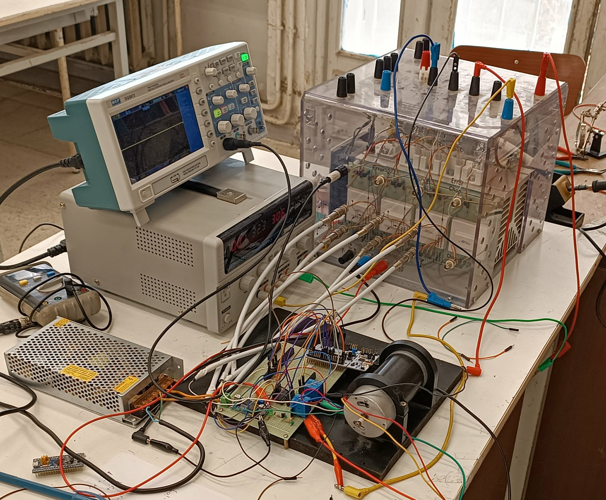
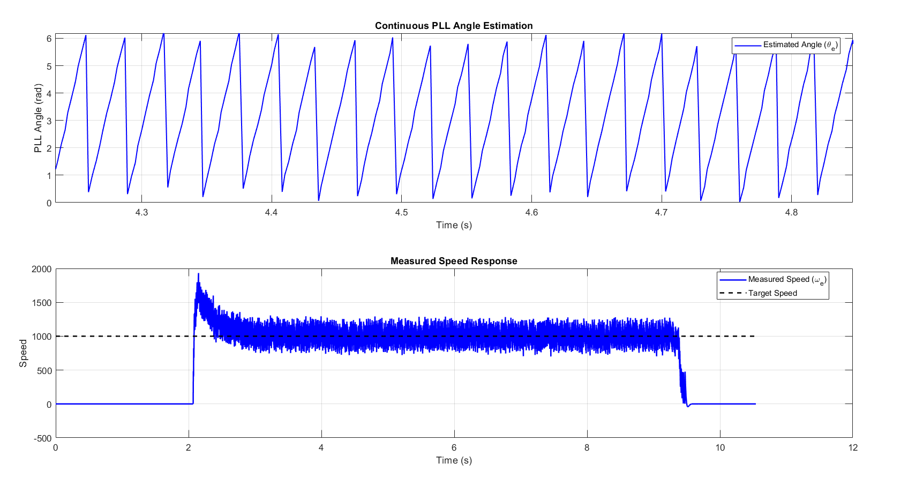
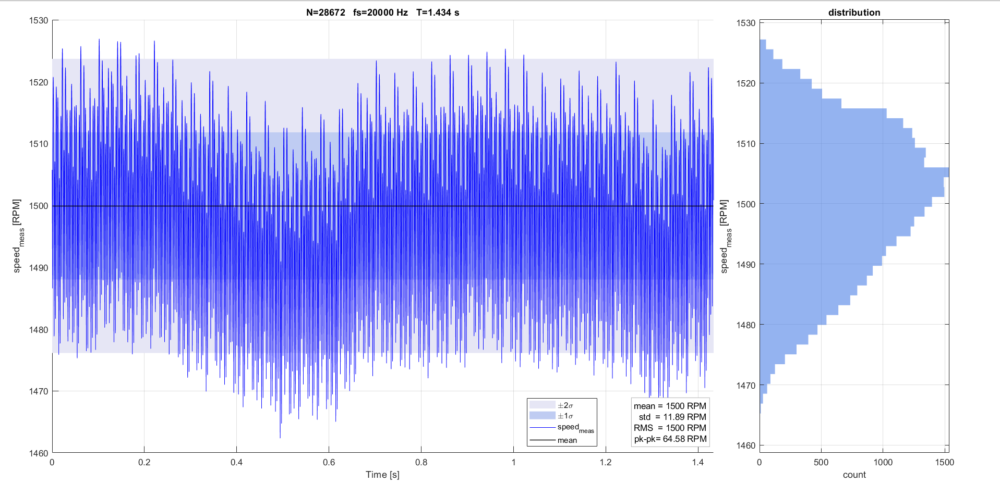
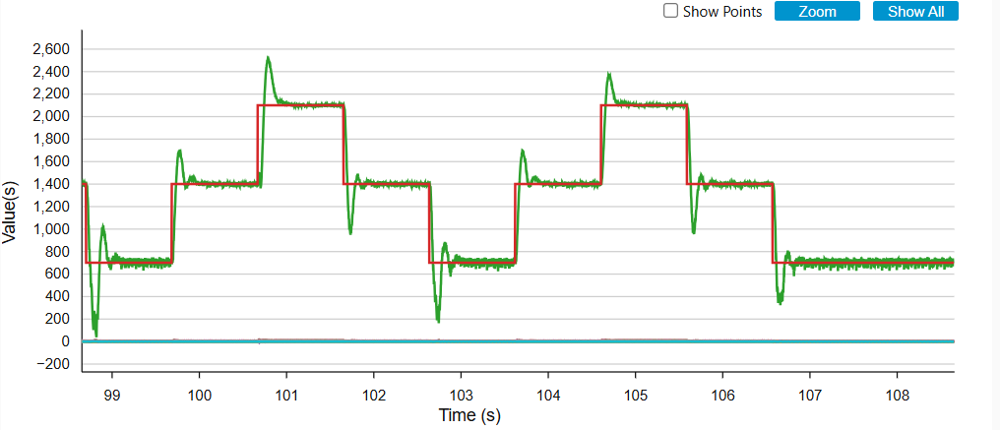
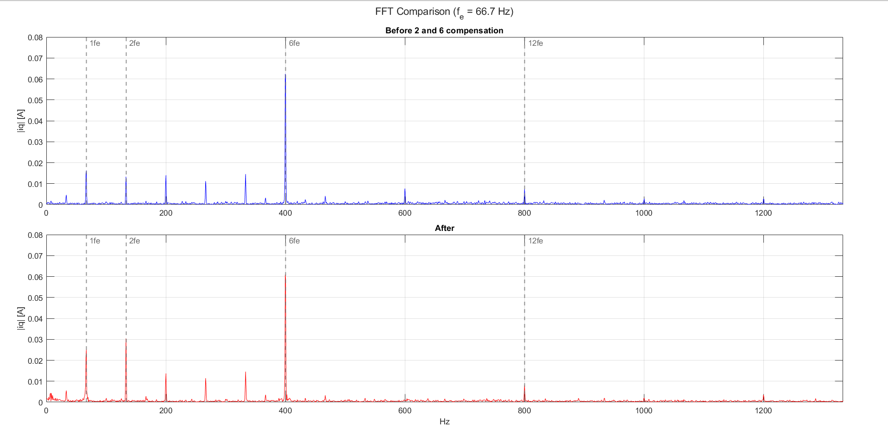

# Field Oriented Control for a PMSM on STM32F446RE

Sensored Field Oriented Control (FOC) of a permanent magnet synchronous motor (PMSM), driven from three Hall effect sensors only — six discrete positions per electrical revolution — and running on an STM32F446RE at a 20 kHz control rate. Built from scratch in C on STM32 HAL/LL, with a Simulink model used to validate the control structure before it was ported to the target.

<p align="center">
  
</p>

## What's in here

A Hall-sensor angle only tells the controller where the rotor was up to 60 electrical degrees ago. Everything in this project exists to close that gap and keep the current loop clean despite it:

- **Rotor angle reconstruction** — a tracking phase-locked loop (PLL) turns the six-step Hall signal into a continuous electrical angle, and its integrator state doubles as a filtered speed estimate for the outer loop, without ever differentiating the position.
- **Field Oriented Control** — Clarke/Park transforms, PI current loops with feed-forward decoupling, and Space Vector PWM (SVPWM) generation, all inside a single 50 µs interrupt on a Cortex-M4 with hardware FPU.
- **Two speed control strategies, compared** — a classic PI controller and a discrete sliding mode controller with a boundary layer and an integral sliding surface, both fed by a jerk-limited reference generator so a setpoint step never turns into a torque step.
- **Harmonic compensation** — the fundamental, 2nd and 6th harmonics seen in the `dq` currents (current-sensor offset, gain mismatch, and inverter dead-time) are estimated and cancelled online with one shared period-synchronous projection technique.
- **Parameter identification and measurement** — stator resistance/inductance, mechanical inertia and friction identified experimentally on the bench, and an on-target logger (read out over GDB) that captures a channel at the full 20 kHz control rate for offline spectral analysis in MATLAB.

## Results

<table>
<tr>
<td width="50%">

<p align="center"><sub>Continuous angle reconstructed from the Hall sensors, and the resulting speed response</sub></p>
</td>
<td width="50%">

<p align="center"><sub>Steady-state speed regulation at 1500 rpm: σ = 11.89 rpm (0.79%)</sub></p>
</td>
</tr>
<tr>
<td width="50%">

<p align="center"><sub>Multi-step speed response (sliding mode controller)</sub></p>
</td>
<td width="50%">

<p align="center"><sub><code>i_q</code> spectrum before/after compensation — the fundamental offset drops cleanly, the 2nd/6th need a model-based approach</sub></p>
</td>
</tr>
</table>

## Hardware

| | |
|---|---|
| MCU | STM32F446RE (Nucleo-F446RE), Cortex-M4, 180 MHz, single-precision FPU |
| Inverter | Semikron SEMITEACH educational inverter, SKM 50 GB 123 D IGBTs, SKHI 22A-R gate drivers |
| Motor | RS PRO brushless PMSM, 3-phase, 3 Hall sensors, 2 pole pairs (identified) |
| Position sensing | 3× Hall effect sensors, 60° electrical resolution |
| Supply | 24 V DC lab supply, 6 A current limit |
| Debug/monitoring | ST-LINK (SWD), STM32CubeMonitor, DQ5072 oscilloscope |

## Software architecture

The firmware is layered `hw` → `core` → `app`:

```
Core/Src/
├── hw/       hardware drivers: PWM timers, ADC, Hall sensor decoding
├── core/     control math: FOC transforms, PI, sliding mode, PLL,
│             harmonic compensators, SVPWM, reference generator
└── app/      motor control loop, state machine
```

Built with CMake + Ninja and the `arm-none-eabi-gcc` toolchain (see [`CMakePresets.json`](CMakePresets.json)), peripherals configured through STM32CubeMX (`FOC_IMP.ioc`), flashed and debugged via OpenOCD/GDB.

```bash
cmake --preset Debug
cmake --build --preset Debug
```

## Repository layout

| Path | Contents |
|---|---|
| `Core/` | Application firmware (see architecture above) |
| `Drivers/` | STM32 HAL/LL drivers and CMSIS (vendor code) |
| `tools/` | MATLAB scripts: parameter identification, FFT/spectral analysis, log plotting |
| `docs/images/` | Figures used in this README |
| `*.md` | Working notes from the bring-up: [`FOC_DEBUG_REPORT.md`](FOC_DEBUG_REPORT.md) (root-cause debugging of the early control loop), [`motor_alignment_id.md`](motor_alignment_id.md) (Hall/phase alignment), [`references_hall_sensor_harmonics.txt`](references_hall_sensor_harmonics.txt) |

## Status

Speed and current loop tracking validated experimentally; PI and sliding mode controllers found equivalent under the no-load conditions of this bench (expected — active `dq` decoupling already linearizes the drive, and the sliding mode controller's robustness advantage was never solicited without a load). Current-sensor offset compensation is conclusive; 2nd/6th harmonic compensation is implemented but calls for a model-based formulation to be effective.
